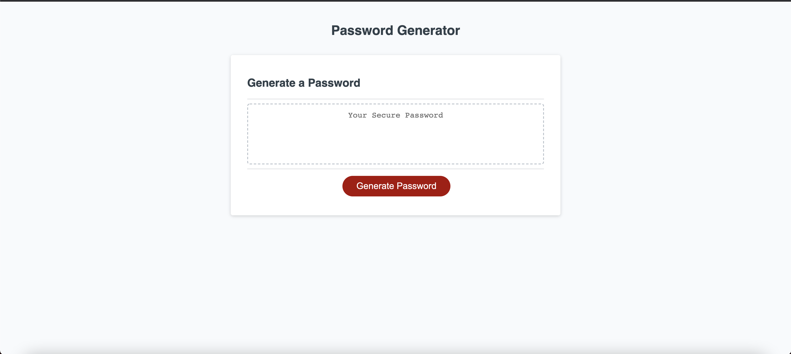

# Password-Generator-W3

## User Story

```
AS AN employee with access to sensitive data
I WANT to randomly generate a password that meets certain criteria
SO THAT I can create a strong password that provides greater security
```

## Acceptance Criteria

```
GIVEN I need a new, secure password
WHEN I click the button to generate a password
THEN I am presented with a series of prompts for password criteria
WHEN prompted for password criteria
THEN I select which criteria to include in the password
WHEN prompted for the length of the password
THEN I choose a length of at least 8 characters and no more than 128 characters
WHEN prompted for character types to include in the password
THEN I choose lowercase, uppercase, numeric, and/or special characters
WHEN I answer each prompt
THEN my input should be validated and at least one character type should be selected
WHEN all prompts are answered
THEN a password is generated that matches the selected criteria
WHEN the password is generated
THEN the password is either displayed in an alert or written to the page
```
## Solving the Task

### Given that I was tasked to create a generator and I needed to have 5 different sets of criteria. I started by creating 5 functions for each set of criteria.

1. For the first criteria which is the length of the password: I started by creating a prompt with conditionals to re-run the code if the length is not between 8-128 characters.
2. For the second through fifth functions I went with prompts as well with conditionals where the it accounted for the yes and no question and also if the input was left blank.
    If blank or the yes and no wasn't strictly equal to 'Yes or y" and 'No or n'.
3. I created one final function that will take all store criteria area and generated a password with the stored criteria.
    - Started by running the functions at the top inside the 'generatePassword' function.
    - I then created conditionals for every combination of sets of criteria.
    - Finally I created a For loop that will randomize a number and then times it by the selected length of the password, I then use Math.Floor to give me a number rounded down to the nearest whole number. Using the 'charAt' method I can then change a string into single characters, and use it as an array to return a single character at a time.

### Cleaning My Code

1. When I finished and tested my code I realized that I was repeating myself alot.
    - When I created functions 2-5 they were the exact same function but with different variables. I then changed the prompts into confirms and place all the criteria in comfirms and placed them in the 'generatePassword' fucntion.
    - Confirms are either true or false already so it was simpler to use than prompts and making if and else statements to return true or false.

## Link to deployed applicaton
- https://juawito.github.io/Password-Generator-W3[https://juawito.github.io/Password-Generator-W3/]

